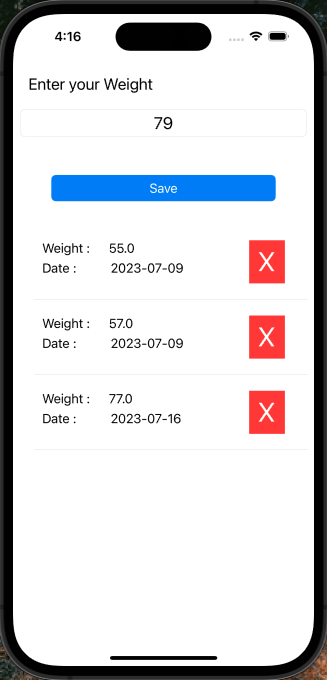

# Suivre mon poids iOS Application

This project is an iOS application named "Suivre mon poids" that allows users to track and monitor their weight over time.

## Features

- Add your weight, and the application automatically generates the date of the day that you added it.
- View a list of all your recorded weights and the corresponding dates.
- Delete or update any of the elements (date, weight) in the list.

## Screens

The project includes the following screens:

- **Home**: This screen demonstrates how to add and display weight entries and provides the option to delete items from the list.

   

The screenshots for the application's screens can be found in the `screens` folder of the repository.

Feel free to explore the repository and the screenshots to get a better understanding of the application.

## Installation

To run the "Suivre mon poids" iOS application locally, follow these steps:

1. Clone the repository: `git clone https://github.com/your-username/suivre-mon-poids-ios.git`.
2. Open the project in Xcode.
3. Build and run the application on an iOS simulator or device.

Make sure you have the necessary dependencies and a compatible version of Xcode installed.

## Contributing

If you'd like to contribute to this project, please follow these guidelines:

1. Fork the repository.
2. Create a new branch: `git checkout -b feature/your-feature`.
3. Make your changes and commit them: `git commit -m 'Add your feature'`.
4. Push to the branch: `git push origin feature/your-feature`.
5. Submit a pull request.

Please ensure your code follows the project's coding style and includes appropriate documentation.

## License

This project is licensed under the [MIT License](LICENSE). Feel free to use and modify the code according to your needs.

## Acknowledgements

We would like to thank the following resources for their contributions and inspiration:

- [CorePlot](https://github.com/core-plot/core-plot) - The library used for plotting the weight data.
- [IconFinder](https://www.iconfinder.com) - The source of the application's icons.

If you have any questions or feedback, please don't hesitate to contact us.
